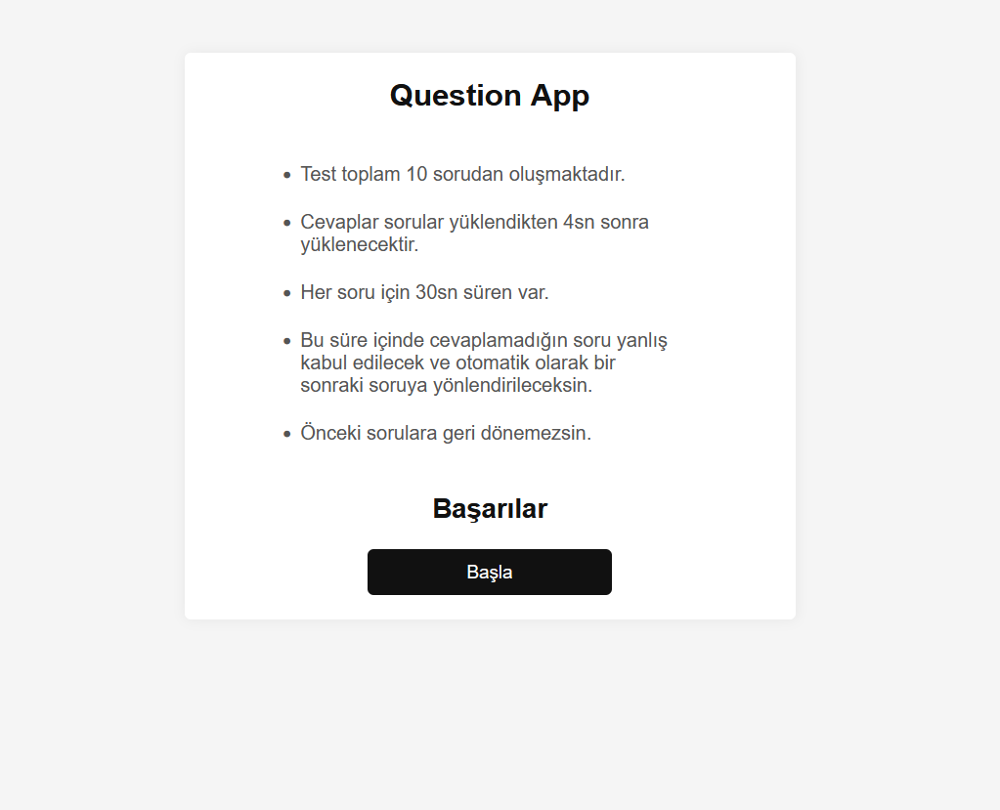
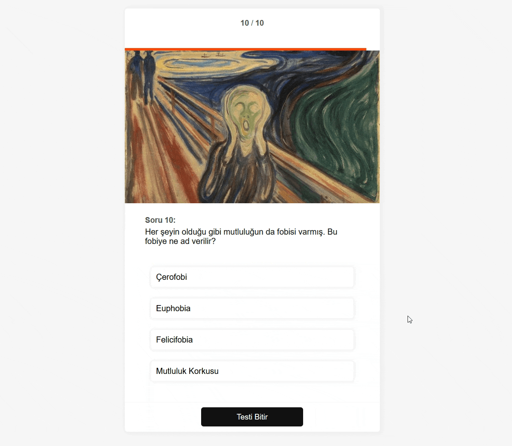

<h1 align="center">QUESTION APP</h1>  

  

<h3 align="center">Used Languages and Tools:</h3>  

 
     &nbsp;
     &nbsp;
     &nbsp;
     &nbsp;

<h3 align="center"><a href="https://hsnyar-questionapp.netlify.app/">🔗  Project Link</a></h3>

<h3 align="center">📝 About</h3>

This is a project that I made while im in Ptakia+ Front-End Developer Bootcamp

<h3 align="center">🚀 Features & Screenshots</h3>

<h4 align="center">Start of the Quiz</h4>

<h4 align="center">End of the Quiz</h4>

